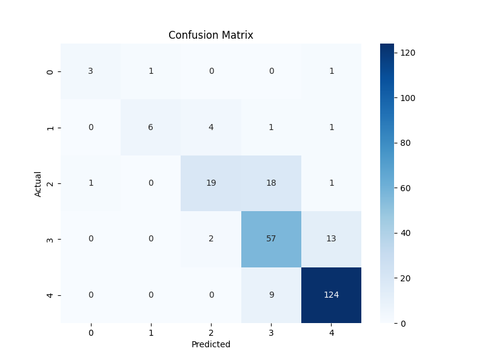

1. # Model Evaluation Report
2. ## Overview
3. The trained classification model has been evaluated on the test set. This report summarizes the performance of the model using various classification metrics.
4. ## Classification Report
5. ```
              precision    recall  f1-score   support

           1       0.75      0.60      0.67         5
           2       0.86      0.50      0.63        12
           3       0.76      0.49      0.59        39
           4       0.67      0.79      0.73        72
           5       0.89      0.93      0.91       133

    accuracy                           0.80       261
   macro avg       0.78      0.66      0.71       261
weighted avg       0.80      0.80      0.79       261
```
6. ## Confusion Matrix
7. The confusion matrix provides a detailed breakdown of correct and incorrect classifications for each class.
8. 
9. ## Interpretation
10. The model achieved an overall accuracy of 80%. The precision, recall, and f1-score vary across the different classes, with class 5 having the best performance. The confusion matrix shows that the model performs well in distinguishing the majority class (class 5) but has some difficulty with the minority classes, particularly with class 3 being misclassified as class 4.
11. ## Conclusion
12. The model shows good overall performance but could be improved, particularly for the minority classes. Further analysis and potentially more data for the underrepresented classes could help to improve the model.
