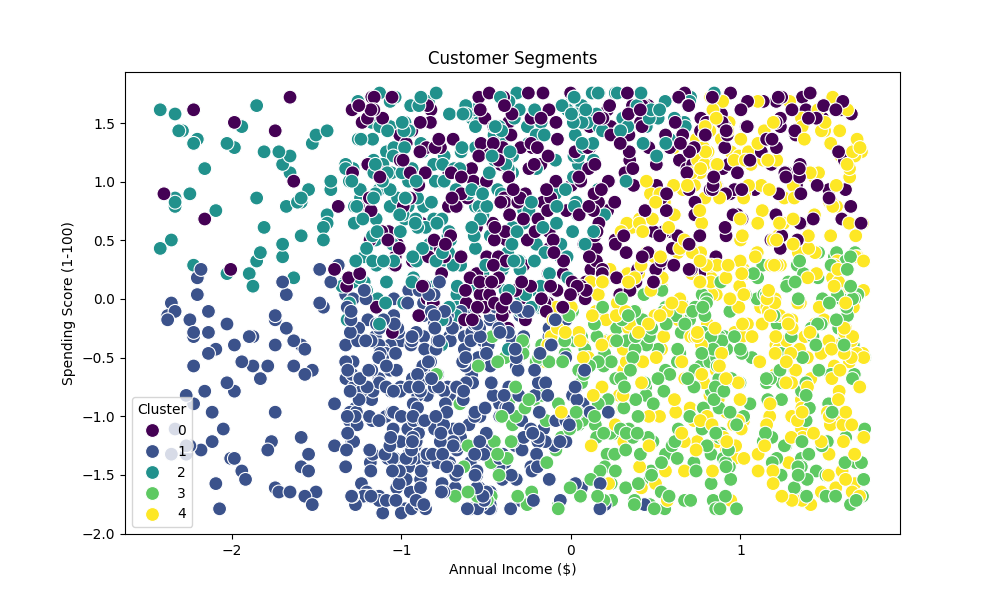
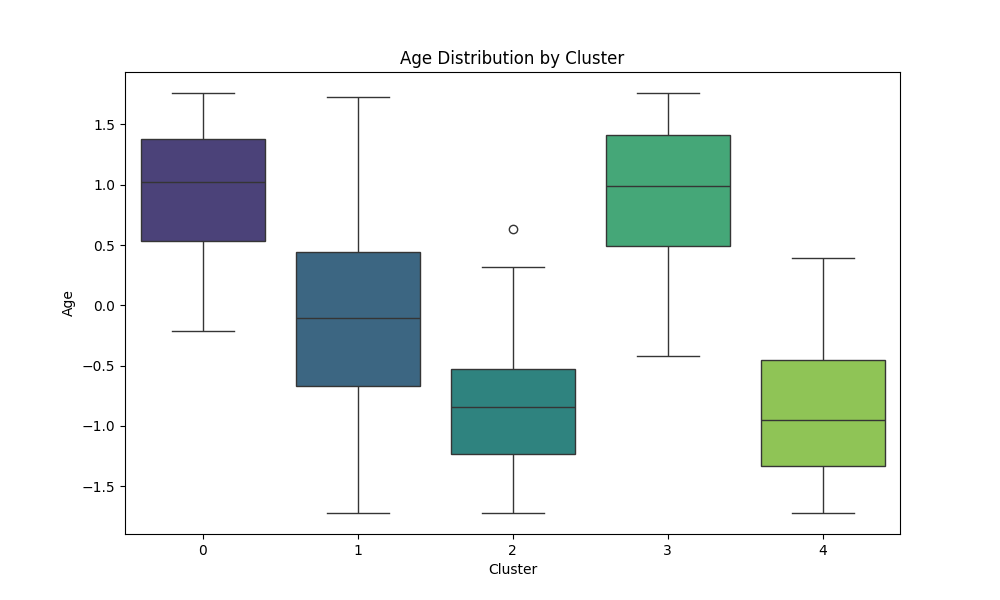
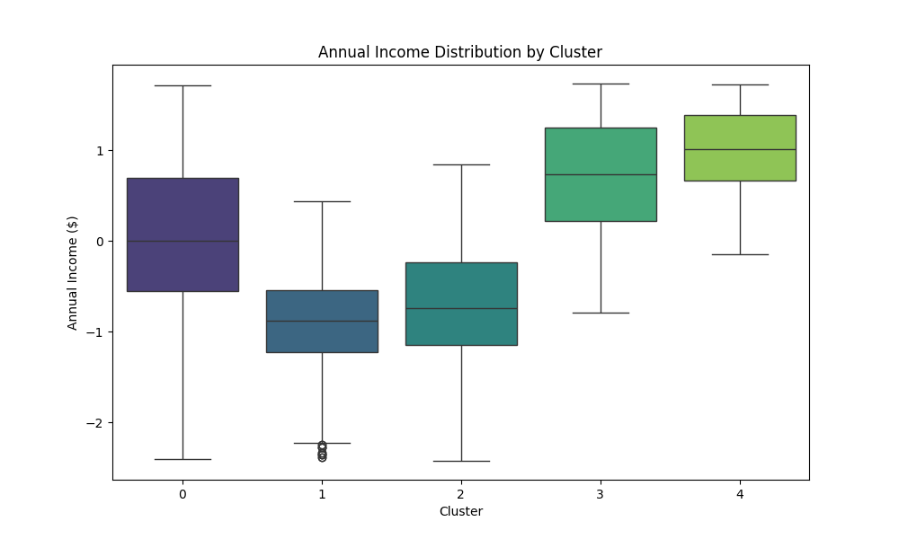
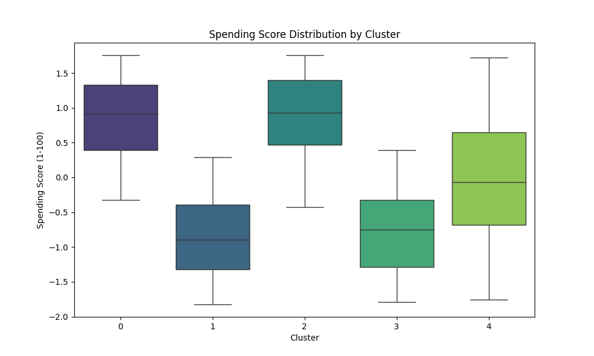

1. 
# Visualization Report

This report presents visualizations of the customer segmentation results.

## Customer Segments Scatter Plot

This scatter plot shows the distribution of customers based on their annual income and spending score, with each point colored by its assigned cluster.

## Age Distribution by Cluster

This boxplot shows the distribution of age for each customer cluster.

## Annual Income Distribution by Cluster

This boxplot shows the distribution of annual income for each customer cluster.

## Spending Score Distribution by Cluster

This boxplot shows the distribution of spending score for each customer cluster.

